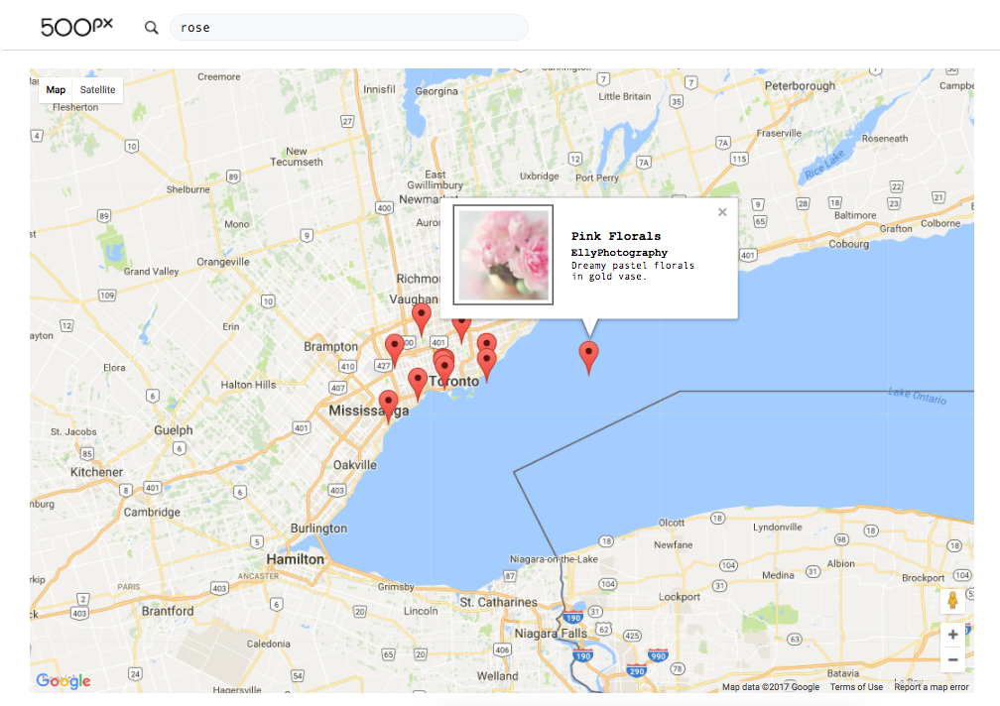

# Google Maps and 500px API

A web application that makes an API request to Google Maps to display a map centered around downtown Toronto. Another API request fetches data from 500px to return images within 50km of Toronto. Each image is displayed with a marker on the Google map according to its location. Clicking on the marker opens an infowindow that revelas additional information about the image.

Here's a screenshot of the application:

